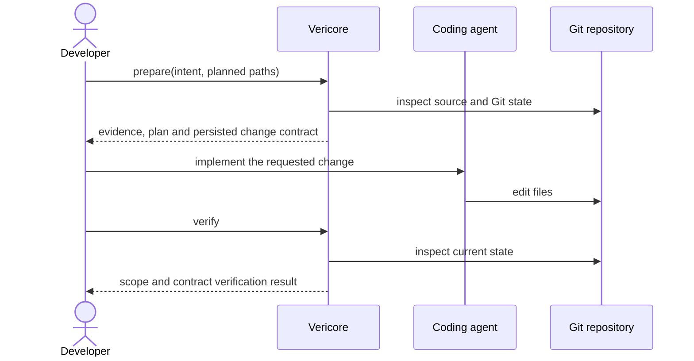

<p align="center">
  
</p>

<h1 align="center">Vericore</h1>

<p align="center">
  <strong>AI writes the code. Vericore verifies the change.</strong>
</p>

<p align="center">
  An open-source, local-first verification layer for AI coding agents.
</p>

<p align="center">
  <a href="https://github.com/sonii-shivansh/Vericore/actions/workflows/ci.yml"></a>
  <a href="https://github.com/sonii-shivansh/Vericore/actions/workflows/release-audit.yml"></a>
  <a href="https://github.com/sonii-shivansh/Vericore/actions/workflows/docs-parity.yml"></a>
  <a href="https://github.com/sonii-shivansh/Vericore/releases"></a>
  <a href="LICENSE"></a>
</p>

AI coding agents can make large repository changes quickly. The engineering question is whether the final change stayed within the intended scope and whether the evidence used to assess it still describes the same repository state.

**Vericore establishes a repository-bound change boundary before an edit, then checks the actual repository state afterward.** It adds deterministic engineering evidence and a repeatable verification step around your existing coding-agent workflow. It is designed to complement agents, tests, and human review—not replace them.

## How it works



Preparation records the boundary Vericore will later evaluate. Verification uses the original persisted Agent Change Contract rather than silently deriving a replacement from the already-mutated working tree.

## Try the workflow

After installing Vericore, run this from the repository you want to analyze:

```bash
vericore init
vericore scan --path .
vericore inspect --path .
```

Before asking an AI agent to make a change, prepare the boundary:

```bash
vericore prepare "add payment validation" \
  --path . \
  --planned-path src/main/kotlin/com/example/PaymentService.kt
```

Use your normal coding agent to make the edit, then verify the original boundary:

```bash
vericore verify --path .
```

Run your project's normal tests and review the diff as well. A Vericore result is evidence about the defined repository/change contract; it is not a proof that a feature is semantically correct.

**First time here?** Follow [Getting Started](docs/GETTING_STARTED.md) for installation, first-run checks, analysis, and the complete prepare → change → verify workflow.

## Install

The latest published release is available on [GitHub Releases](https://github.com/sonii-shivansh/Vericore/releases). Platform archives bundle a Java runtime for normal end-user use.

**Linux / macOS**

```bash
curl -fsSL https://raw.githubusercontent.com/sonii-shivansh/Vericore/main/scripts/install.sh | bash
```

**Windows PowerShell**

```powershell
irm https://raw.githubusercontent.com/sonii-shivansh/Vericore/main/scripts/install.ps1 | iex
```

Then validate the local installation:

```bash
vericore doctor
vericore --version
```

The installers select the latest **published** release and verify the archive's SHA-256 checksum before installation. Supported packaged targets are Linux x64, Windows x64, macOS x64, and macOS arm64. The main branch can contain unreleased work that is not part of those published archives.

For manual installation, source builds, or troubleshooting, see [Getting Started](docs/GETTING_STARTED.md).

## What Vericore provides

- **Repository understanding:** Java/Kotlin source analysis, dependency graphs, Git signals, and architecture indicators.
- **Change impact and PR intelligence:** deterministic signals for changed files, affected components, architecture, and risk.
- **Grounded engineering context:** repository-bound snapshots, evidence, and evidence-backed plans.
- **Prepare / verify contracts:** planned paths and repository state are persisted before the edit, then checked after the edit.
- **Agent integration:** a local Model Context Protocol (MCP) server and a reusable GitHub Action.
- **Machine-readable output:** versioned JSON artifacts for automation alongside human-readable CLI output.

The principle behind these features is simple: **deterministic repository evidence first; optional AI reasoning second.** AI-provider integration is optional and is disabled unless configured.

## Integrate Vericore

### AI-agent workflows

Generate MCP client configuration:

```bash
vericore mcp-config
```

The local MCP surface exposes repository analysis, engineering context, evidence, planning, preparation, and verification capabilities. See [MCP / AI-agent integration](docs/MCP.md) and [Change Safety](docs/CHANGE_SAFETY.md).

### GitHub Actions

Vericore can run in a workflow using the published action:

```yaml
- uses: actions/checkout@v7
- uses: sonii-shivansh/Vericore@v0.9.0
  with:
    command: analyze
```

The action downloads a published platform archive, verifies its SHA-256 checksum, and runs the requested command. The example uses the latest published Vericore action tag at the time of writing. For stricter supply-chain controls, pin third-party actions to a reviewed immutable commit SHA and update it deliberately.

See [GitHub Action](docs/GITHUB_ACTION.md) for inputs, outputs, security boundaries, and examples.

## Supported scope and honest boundaries

Vericore currently focuses on **Java and Kotlin repositories**. Kotlin parsing is regex-based and has known limitations with complex syntax; it is not a Kotlin compiler front end.

- Vericore analyzes source; it does not autonomously modify source code.
- The planner is read-only, and an Agent Change Contract is a verification boundary—not an authorization system.
- A PASS result does not replace unit/integration tests, semantic review, or human judgment.
- Local REST and MCP are intended for trusted local/internal use. The application does not currently provide production-grade authentication, authorization, tenant isolation, or deployment-level TLS.
- Optional provider-backed AI can receive bounded repository-derived context when configured and invoked. Review [Data & Privacy](docs/DATA_PRIVACY.md) before enabling it.

See the [Support Matrix](docs/SUPPORT_MATRIX.md) and [Implementation Status](docs/IMPLEMENTATION_STATUS.md) for specific capabilities and limitations.

## Documentation

| Goal | Start here |
|---|---|
| Understand the product | [Why Vericore?](docs/WHY_VERICORE.md) |
| Install and run your first workflow | [Getting Started](docs/GETTING_STARTED.md) |
| Find a command's exact syntax and behavior | [CLI Reference](docs/CLI.md) |
| Understand system design and trust boundaries | [Architecture](docs/ARCHITECTURE.md) |
| Explore the code and folder layout | [Repository Map](docs/REPOSITORY_MAP.md) |
| Connect an AI agent | [MCP](docs/MCP.md) |
| Integrate a REST client | [API](docs/API.md) |
| Review privacy and data handling | [Data & Privacy](docs/DATA_PRIVACY.md) |
| Build, test, or contribute | [Development](docs/DEVELOPMENT.md) |
| Browse every guide and engineering record | [Documentation Hub](docs/INDEX.md) |

## Build from source

Requirements: JDK 21+ and Git.

```bash
git clone https://github.com/sonii-shivansh/Vericore.git
cd Vericore
./gradlew --no-daemon clean test
./gradlew --no-daemon build installDist
```

The installed CLI is under `build/install/vericore/bin/`. GitHub Actions is the authoritative clean-environment validation path used for release certification.

## Contribute

Issues with a small reproduction, precise command output, and repository details (with secrets removed) are especially useful. Start with [Contributing](CONTRIBUTING.md); report security vulnerabilities privately using [Security Policy](SECURITY.md).

If Vericore is useful in your agent workflow, a GitHub star helps other developers discover it. Honest bug reports, reproducible cases, and focused contributions help the project improve.

## License

Vericore is released under the [MIT License](LICENSE).
