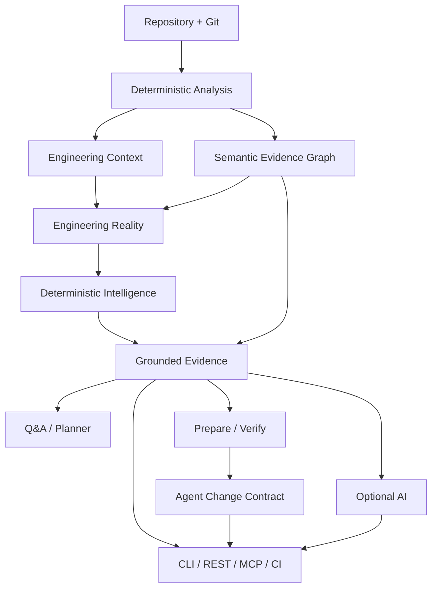

<p align="center">
  
</p>

# Vericore

**Understand. Change. Verify.**

**Evidence-grounded engineering intelligence for your codebase.**

Vericore is a Kotlin/JVM CLI and local REST application for Java and Kotlin repositories. It combines deterministic source analysis, dependency structure, Git signals, architecture intelligence, grounded evidence, engineering planning, and a prepare → change → verify safety boundary.

> **Core principle:** deterministic evidence first; optional AI reasoning second.

## Current status

Vericore `0.8.1` is the latest **published** release. `0.8.2` is the current release-preparation branch and must pass complete release certification and fresh artifact validation before publication.

## What Vericore does

- analyzes Java and Kotlin source code;
- builds dependency graphs, cycles, PageRank hotspots, and engineering risks;
- analyzes Git history, change impact, PR signals, and codebase evolution;
- evaluates architecture, architecture drift, and deterministic architecture contracts;
- creates versioned engineering-context and Engineering Reality artifacts;
- builds a deterministic semantic evidence graph over repository evidence;
- retrieves grounded repository evidence for developer questions;
- generates evidence-backed engineering plans;
- creates repository-bound Agent Change Contracts for safe change verification;
- provides optional provider-backed AI assistance;
- exposes a local REST API;
- exposes a local MCP stdio server for AI-agent integrations;
- validates the product with clean-environment and cross-platform GitHub Actions workflows.

## Quick start

### From a released archive

Released platform archives bundle the Java runtime for normal end-user use:

```text
Windows:      bin\\vericore.bat --version
Linux/macOS:  ./bin/vericore --version
```

### From source

```bash
git clone https://github.com/sonii-shivansh/Vericore.git
cd Vericore
./gradlew --no-daemon clean test
./gradlew --no-daemon installDist
./build/install/vericore/bin/vericore --version
```

### Analyze a repository

```bash
vericore analyze /path/to/repository
vericore evidence-graph /path/to/repository --json
vericore reality /path/to/repository --json
```

The HTML report is written to `output/index.html`. Machine-readable artifacts are written under the analyzed repository's `output/` directory when the relevant command requests them.

### Ask a grounded repository question

```bash
vericore repo-qa "Why is PaymentService risky?" --path /path/to/repository
```

### Prepare and verify a change

```bash
vericore prepare "add payment validation" --path /path/to/repository
# make the code change
vericore verify --path /path/to/repository
```

`prepare` persists the engineering context, engineering plan, and Agent Change Contract. `verify` checks the original persisted contract; it does not silently replace it.

### Run the local API

```bash
vericore server --host 127.0.0.1 --port 8080
curl --fail http://127.0.0.1:8080/health
```

Keep the server on loopback for local development. The application does not provide deployment-grade authentication, authorization, tenant isolation, or TLS.

### Connect an AI agent

```bash
vericore mcp
```

See [MCP](docs/MCP.md) for the tool contract.

## CLI reference

The complete command reference is maintained separately so the README stays concise:

**[→ Complete CLI Reference](docs/CLI.md)**

It documents all current commands, syntax, options, defaults, output artifacts, failure behavior, and recommended workflows.

At a glance, the CLI provides:

```text
analyze
impact
architecture
architecture-drift
architecture-contract
context-snapshot
context-diff
evidence-graph
reality
pr-intelligence
repo-qa
plan
prepare
verify
ask
evolution
server
mcp
setup
doctor
```

Global discovery:

```bash
vericore --help
vericore --version
```

## Architecture



See [Architecture](docs/ARCHITECTURE.md) for package boundaries and trust boundaries.

## Configuration and privacy

Recommended setup:

```bash
vericore setup
vericore doctor
```

The canonical project configuration file is `.vericore.json`. `VERICORE_ALLOWED_PATHS` controls server workspace boundaries. API keys must never be committed.

Vericore is local-first. Deterministic analysis does not require an external service. AI is opt-in and sends bounded repository-derived context to the configured provider when invoked.

See [Data & Privacy](docs/DATA_PRIVACY.md).

## Development and CI

```bash
./gradlew --no-daemon clean test
./gradlew --no-daemon build installDist
```

GitHub Actions is the authoritative clean-environment verification path for the product. It validates builds, tests, CLI flows, generated artifacts, intelligence features, safety contracts, REST/MCP boundaries, and cross-platform/live-repository behavior.

See [Contributing](CONTRIBUTING.md) and [Development](docs/DEVELOPMENT.md).

## Documentation

| Topic | Document |
|---|---|
| Start here | [Getting Started](docs/GETTING_STARTED.md) |
| **Complete CLI reference** | [CLI](docs/CLI.md) |
| Documentation hub | [docs/INDEX.md](docs/INDEX.md) |
| Architecture | [Architecture](docs/ARCHITECTURE.md) |
| Engineering Reality | [Engineering Reality](docs/ENGINEERING_REALITY.md) |
| Change Safety | [Change Safety](docs/CHANGE_SAFETY.md) |
| REST API | [API](docs/API.md) |
| MCP / AI agents | [MCP](docs/MCP.md) |
| PR Intelligence | [PR Intelligence](docs/PR_INTELLIGENCE.md) |
| Data & Privacy | [Data & Privacy](docs/DATA_PRIVACY.md) |
| Development | [Development](docs/DEVELOPMENT.md) |
| Implementation status | [Implementation Status](docs/IMPLEMENTATION_STATUS.md) |
| Release preparation | [0.8.2 Release Readiness](docs/RELEASE_READINESS_0.8.2.md) |
| Published release record | [0.8.1 Release Readiness](docs/RELEASE_READINESS_0.8.1.md) |
| Previous release record | [0.8.0 Release Readiness](docs/RELEASE_READINESS_0.8.0.md) |
| Contributing | [Contributing](CONTRIBUTING.md) |
| Security | [Security](SECURITY.md) |

## License

Vericore is released under the MIT License. See [LICENSE](LICENSE).
