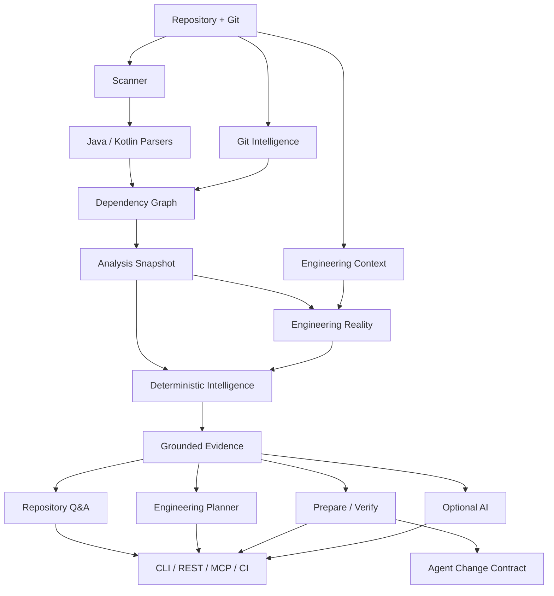
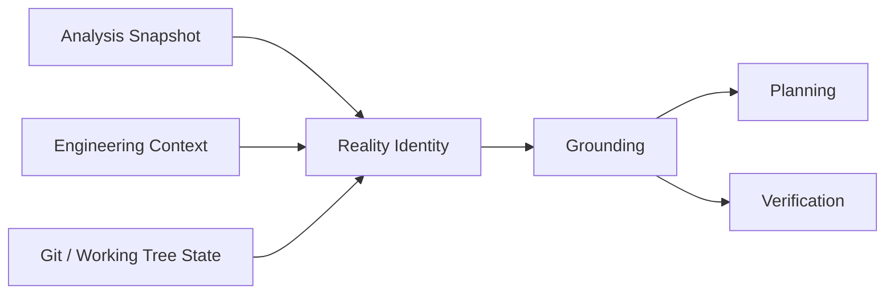

# Architecture

> Understand the system boundary, the data flow, and the rules that keep repository facts deterministic.

## Purpose

Vericore is a local-first engineering-intelligence system for Java and Kotlin repositories. It turns source code, Git history, dependency structure, and engineering signals into deterministic facts, grounded evidence, planning artifacts, and safe verification workflows.

**Core rule:** deterministic evidence first; optional AI reasoning second.

## Start here

If you are new to the codebase, read these in order:

1. [Getting Started](GETTING_STARTED.md)
2. This document
3. [Engineering Reality](ENGINEERING_REALITY.md)
4. [Change Safety](CHANGE_SAFETY.md)
5. [Development](DEVELOPMENT.md)

## System flow



## Layers and responsibilities

| Layer | Responsibility | Key rule |
|---|---|---|
| Repository boundary | Discover files, Git state, and repository metadata | Never execute analyzed source |
| Parser layer | Extract Java/Kotlin structure | Parsing limitations must be explicit |
| Graph layer | Dependencies, cycles, PageRank | Ordering and tie-breaking are deterministic |
| Analysis snapshot | Stable machine-readable analysis boundary | Higher layers consume facts, not scanners directly |
| Engineering Reality | Bind compatible analysis/context/repository state | Identity must not depend on wall-clock time |
| Intelligence | Impact, architecture, PR, evolution, risk and related signals | Deterministic output |
| Evidence | Convert facts into bounded citations | Preserve provenance and repository-relative paths |
| Planner | Produce evidence-backed implementation plans | Read-only; no source mutation |
| Workflow | Prepare and verify repository changes | Verification uses the persisted contract |
| Adapters | CLI, REST, MCP, CI | Orchestrate application services; do not own domain rules |
| AI boundary | Optional provider-backed reasoning | AI cannot replace deterministic repository truth |

## Engineering Reality

Engineering Reality is the state-identity boundary between deterministic analysis and downstream reasoning.



The reality identity deliberately excludes analysis wall-clock time. Equivalent repository state and deterministic facts should not produce a different identity merely because they were analyzed at different times.

See [Engineering Reality](ENGINEERING_REALITY.md).

## Prepare / Verify safety boundary

```text
prepare
  ↓
engineering context + evidence + plan
  ↓
persist Agent Change Contract
  ↓
developer / agent changes working tree
  ↓
verify persisted contract
  ↓
scope + repository identity + prepared HEAD + plan binding
```

`AgentChangeContract` records repository identity, prepared Git `HEAD`, planned paths, expected components, verification commands, evidence IDs, architecture expectations, and a SHA-256 fingerprint.

**Important:** the persisted contract is the verification boundary. Verification must not silently reconstruct a replacement contract from a mutable plan.

See [Change Safety](CHANGE_SAFETY.md).

## Source layout

```text
src/main/kotlin/com/vericore/
├── Main.kt
├── cli/                 # user-facing commands and adapters
├── core/
│   ├── ai/             # optional provider integrations
│   ├── cache/          # analysis cache
│   ├── config/         # configuration and credentials
│   ├── exceptions/     # domain/application errors
│   ├── generator/      # report and learning helpers
│   ├── graph/          # dependency graph algorithms
│   ├── intelligence/   # deterministic engineering intelligence
│   ├── parser/         # language parsing contracts
│   ├── planner/        # evidence-backed planning
│   ├── qa/             # repository Q&A and retrieval
│   ├── reality/        # cross-artifact state identity
│   ├── scanner/        # repository discovery and Git signals
│   ├── temporal/       # history/evolution analysis
│   └── workflow/       # prepare/verify and change-safety contracts
├── enterprise/         # organization-oriented capabilities
├── mcp/                # local MCP protocol adapter
├── output/             # report generation
└── server/             # local REST boundary
```

### Architecture rule for new code

> **Adapters orchestrate. Core owns deterministic domain behavior. Provider-specific AI code stays behind an explicit boundary.**

Avoid moving folders only for aesthetics. Change package structure when a concrete dependency, ownership, or testability problem justifies the migration.

## Trust boundaries

### Local repository

Repository paths are canonicalized and checked against configured allowed roots. Source is analyzed, not executed.

### REST

The local Ktor server is designed for trusted local/internal use. The application does not provide deployment-grade authentication, authorization, tenant isolation, or TLS.

### MCP

The MCP server is a trusted local integration. It uses the same path-safety boundary and does not provide remote repository access, authentication, or tenant isolation.

### AI

AI is opt-in. Provider calls receive bounded repository-derived context. `repo-qa` is deterministic retrieval; the separate `GroundedAIService` adds explicit evidence-citation prompting for provider-backed reasoning. Credentials belong in configuration or environment variables and must never appear in evidence artifacts or source control.

## Determinism rules

Deterministic artifacts should:

1. declare schema versions;
2. sort collections before hashing or emitting machine-readable results;
3. avoid wall-clock timestamps in identity digests;
4. represent unknown state explicitly instead of inventing facts;
5. preserve repository or commit provenance when available;
6. keep stable tie-breaking rules for ranked results.

## Extension points

- add parsers through `LanguageParser` and `ParserFactory`;
- add deterministic intelligence under `core/intelligence`;
- compose cross-artifact identities under `core/reality`;
- add evidence types without changing existing evidence semantics;
- add retrieval/planning rules with deterministic ordering;
- add workflow contracts under `core/workflow`;
- add CLI/REST/MCP adapters around application services;
- add AI providers behind the provider boundary.

## Keeping this document correct

When architecture changes, update this document in the same pull request. Do not document planned components as implemented. If a boundary is temporary, label it as such and link the issue or follow-up plan.
