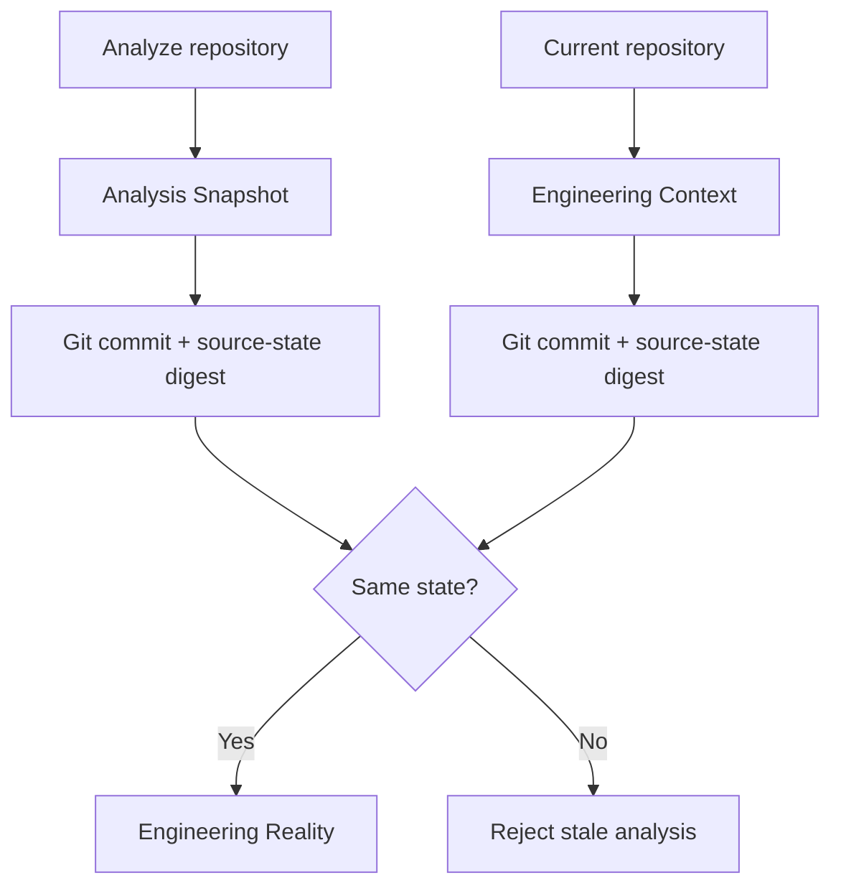
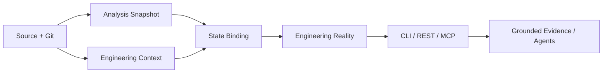
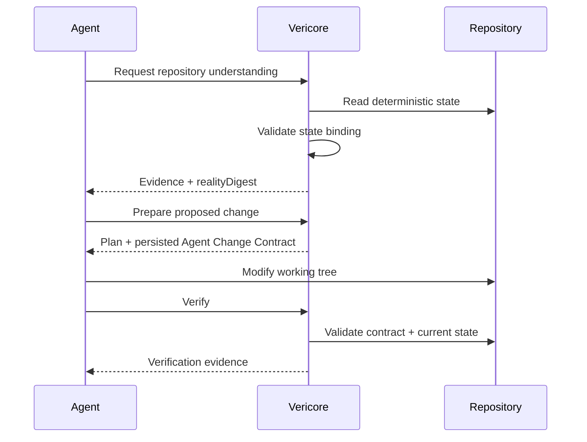

# Engineering Reality

> **Status:** Implemented as the deterministic foundation for repository-state grounding and downstream agent workflows.

Engineering Reality is Vericore's composition layer for answering:

> **Which repository facts belong to the same engineering state?**

It does not replace analysis, architecture, Git, or AI. It binds deterministic artifacts together with explicit schema versions and digests, and it refuses to combine an analysis produced from a different repository state.

## Contents

- [Why it exists](#why-it-exists)
- [State binding](#state-binding)
- [Pipeline](#pipeline)
- [Artifact contract](#artifact-contract)
- [CLI](#cli)
- [AI-agent use](#ai-agent-use)
- [Current boundary](#current-boundary)

## Why it exists

A repository has several valid views of reality: source/dependency analysis, file state, Git state, architecture findings, historical evidence, and engineering decisions. Passing these independently to an AI agent creates an easy failure mode: the agent can accidentally combine artifacts produced from different repository states.

Engineering Reality introduces an explicit identity boundary.

## State binding

The analysis snapshot records two pieces of provenance when available:

- the Git `HEAD` observed during analysis;
- a digest of the source-file state observed during analysis.

When `vericore reality` runs, it creates a fresh engineering-context snapshot and compares those values. A mismatch is rejected instead of producing a plausible-looking but stale reality artifact.



<details>
<summary><strong>Why both commit and source-state digest?</strong></summary>

A Git commit identifies the committed tree, but a developer can have uncommitted source changes. The source-state digest covers the files Vericore can analyze, so a dirty working tree cannot silently reuse an older analysis from the same `HEAD`.

</details>

## Pipeline



<details>
<summary><strong>Deterministic by design</strong></summary>

The reality artifact is derived only from deterministic repository artifacts. AI is not involved in creating the identity or deciding repository facts.

</details>

## Artifact contract

| Field | Meaning |
|---|---|
| `repositoryCommit` | Git `HEAD` when available |
| `languages` | Languages observed by analysis/context |
| `fileCount` | Files included by analysis |
| `graphNodes` / `graphEdges` | Dependency graph size |
| `parseFailures` | Files that did not parse |
| `hasCycles` | Whether dependency cycles were detected |
| `packageCount` | Packages represented in the analysis |
| `crossPackageEdges` | Cross-package dependency edges |
| `hotspotCount` | Retained analysis hotspots |
| `dirty` | Whether the working tree has relevant changes |
| `changedPaths` | Current Git working-tree paths |
| `analysisDigest` | Digest of stable analysis content |
| `contextDigest` | Digest of repository-context content |
| `realityDigest` | Composite identity for the combined state |

The analysis timestamp is deliberately excluded from the identity. Re-running analysis without changing repository state must not manufacture a different reality identity.

## CLI

First create an analysis snapshot:

```bash
vericore analyze .
```

Then create the combined reality artifact:

```bash
vericore reality . --json
```

The command validates that the analysis still belongs to the current repository state before writing:

```text
output/engineering-reality.json
```

If the repository changed after analysis, rerun `vericore analyze` before generating reality.

The command is read-only: it does not modify source code, Git state, commits, or branches.

## AI-agent use



> **AI may reason over Vericore evidence, but it does not define repository truth.**

## Current boundary

Engineering Reality composes deterministic analysis, repository-context artifacts, and the semantic evidence graph identity. The evidence graph contributes repository/commit-bound identity, deterministic graph cardinality, and a stable SHA-256 graph digest to the Engineering Reality contract. The graph does not invent repository facts and does not replace the dependency graph.

Engineering Reality does not include cross-repository system identity or autonomous repository mutation. The separate Agent Change Contract builds on this state identity for the prepare → change → verify workflow. It is a verification boundary, not an authorization system or an autonomous coding mechanism.
