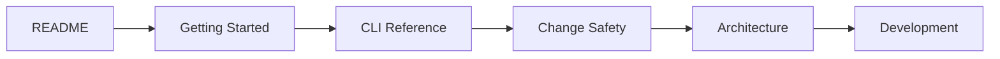

# Documentation Hub

> The shortest route from first use to implementation detail. This index separates end-user guides, contracts, engineering references, roadmap material, and historical release evidence.

## Start here

| Your goal | Read this first |
|---|---|
| Understand the product | [Why Vericore?](WHY_VERICORE.md) |
| Install Vericore and run the main workflow | [Getting Started](GETTING_STARTED.md) |
| Find exact command syntax and behavior | [CLI Reference](CLI.md) |
| Understand the system design | [Architecture](ARCHITECTURE.md) |
| Find code ownership and folder purpose | [Repository Map](REPOSITORY_MAP.md) |
| Browse the complete documentation set | This page |

## User guides and integration contracts

| Document | Scope |
|---|---|
| [Getting Started](GETTING_STARTED.md) | Installation, first-run checks, analysis and prepare → change → verify |
| [CLI Reference](CLI.md) | Canonical user-facing command syntax, options, defaults, outputs and failure behavior |
| [MCP](MCP.md) | Local Model Context Protocol integration and trust boundary |
| [API](API.md) | Local REST routes, request/response shapes and path-safety rules |
| [GitHub Action](GITHUB_ACTION.md) | Action inputs, installation behavior, examples and limitations |
| [Support Matrix](SUPPORT_MATRIX.md) | Implemented language, platform and interface support plus known limitations |

## Architecture, safety and evidence

| Document | Scope |
|---|---|
| [Architecture](ARCHITECTURE.md) | System data flow, component responsibilities, trust boundaries and determinism rules |
| [Repository Map](REPOSITORY_MAP.md) | Top-level folders, Kotlin packages, test fixtures, automation and documentation ownership |
| [Engineering Reality](ENGINEERING_REALITY.md) | State identity and compatibility across analysis/context artifacts |
| [Change Safety](CHANGE_SAFETY.md) | Persisted Agent Change Contract and prepare/verify semantics |
| [Data & Privacy](DATA_PRIVACY.md) | Local behavior, optional provider-bound data flow and privacy boundary |
| [Artifact Schema Catalog](ARTIFACT_SCHEMA_CATALOG.md) | Artifact contracts, schema versions, compatibility and source locations |
| [Semantic Evidence Graph](PHASE_6_SEMANTIC_EVIDENCE_GRAPH.md) | Evidence graph design and implementation scope |
| [PR Intelligence](PR_INTELLIGENCE.md) | Deterministic pull-request analysis |

Machine-readable schemas live in [`docs/schemas/`](schemas/). They are interface contracts; update the relevant schema, tests, and catalog together when an artifact contract changes.

## Development and project policy

| Document | Scope |
|---|---|
| [Development Guide](DEVELOPMENT.md) | Build/test workflow, extension points, review and release discipline |
| [Implementation Status](IMPLEMENTATION_STATUS.md) | Implemented capabilities, limitations and current release/phase state |
| [Product Direction](PRODUCT_DIRECTION.md) | Long-term Phase 0–9 product roadmap; roadmap items are not proof of implementation |
| [Repository Governance](REPOSITORY_GOVERNANCE.md) | Intended repository settings, CI/release model and governance caveats |
| [Verification Benchmark](VERIFICATION_BENCHMARK.md) | Public benchmark design, methodology and interpretation boundaries |
| [Phase 0 Foundation Checklist](PHASE0_FOUNDATION_CHECKLIST.md) | Foundation acceptance criteria and closeout record |
| [Phase 0 Benchmark Baseline](PHASE0_BENCHMARK_BASELINE.md) | Recorded run metadata, methodology, artifact digest and limitations |

## Release documentation

Release-readiness files have different purposes. Published-release records are historical evidence for the exact tag and commit; later commits require their own certification.

| Document | How to interpret it |
|---|---|
| [v0.9.0 Release Readiness](RELEASE_READINESS_0.9.0.md) | Historical certification record for the published v0.9.0 tag; does not certify later commits |
| [v0.8.2 Release Readiness](RELEASE_READINESS_0.8.2.md) | Historical record for the v0.8.2 release |
| [v0.8.1 Release Readiness](RELEASE_READINESS_0.8.1.md) | Historical release record |
| [v0.8.0 Release Readiness](RELEASE_READINESS_0.8.0.md) | Historical release record |
| [v1.0.0 Release Readiness](RELEASE_READINESS_1.0.0.md) | Longer-term pre-1.0 planning checklist; not a published-release claim |
| [Changelog](../CHANGELOG.md) | User-visible changes grouped by version |

## Contribution and community policies

These canonical GitHub/community policy files stay at the repository root so GitHub, contributors, and common repository tooling can discover them:

- [README](../README.md) — project introduction and first-run entry point
- [Contributing](../CONTRIBUTING.md) — contribution workflow
- [Security Policy](../SECURITY.md) — private vulnerability reporting
- [Code of Conduct](../CODE_OF_CONDUCT.md) — community behavior expectations
- [DCO](../DCO.md) — contribution sign-off requirements
- [Trademarks](../TRADEMARKS.md) — permitted brand use
- [License](../LICENSE) — MIT license text

## Recommended reading paths

| Reader | Suggested path |
|---|---|
| New user | README → Why Vericore? → Getting Started → CLI Reference |
| Coding-agent integrator | README → MCP → Change Safety → Data & Privacy |
| Contributor | Repository Map → Architecture → Development → relevant tests |
| Release reviewer | Implementation Status → Release Readiness → exact-SHA GitHub Actions evidence |

## Documentation rules

1. **Implemented behavior wins.** When documents disagree, check the code, executable tests, and public CLI/API/MCP contracts first. Roadmaps and historical plans do not prove that a capability shipped.
2. **One canonical contract per interface.** CLI details belong in [CLI Reference](CLI.md), REST details in [API](API.md), MCP details in [MCP](MCP.md), and artifact compatibility in [Artifact Schema Catalog](ARTIFACT_SCHEMA_CATALOG.md). Other pages should link rather than copy the full contract.
3. **Keep the README scannable.** Use it for the problem, main workflow, install path, boundaries and links—not as a second command reference.
4. **Keep guides task-oriented.** Getting Started should help a user succeed; Development should help a contributor change the code safely.
5. **Preserve historical evidence.** Do not rewrite a release-readiness record or benchmark baseline to match a later release. Add a new versioned record instead.
6. **Use diagrams when they explain structure or sequence.** Prefer Mermaid for flows and architecture so GitHub can render the diagrams directly from Markdown. Every diagram must match implemented behavior and have nearby explanatory text.
7. **State limitations plainly.** Mark planned, optional, unsupported, trusted-local, or not-yet-certified capabilities explicitly. Avoid claims that cannot be traced to implementation and evidence.

## Automated documentation parity

The [documentation parity workflow](../.github/workflows/docs-parity.yml) builds the CLI and compares the runtime `--help` command surface with [CLI Reference](CLI.md). Changes to user-facing commands therefore require an update to the canonical command reference in the same change. Link correctness and factual accuracy still require review; command parity does not validate every statement in every document.
