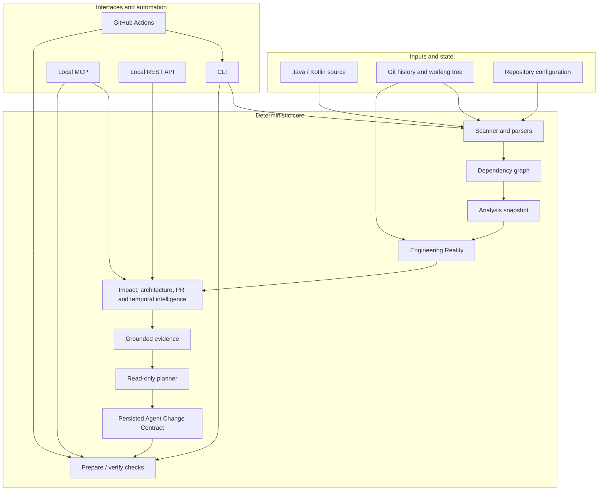

# Repository Map

> A practical map of Vericore's source code, interfaces, tests, automation, and documentation.

Use this page to find the right place to make a change before editing. Package names and directory descriptions below are based on the current repository tree; the code and tests remain authoritative when behavior is unclear.

## System at a glance



The diagram is a conceptual guide, not a class-level call graph. It shows the architectural boundary: deterministic repository facts are produced before optional provider-backed reasoning, and the planner does not modify application source.

## Top-level directory map

```text
Vericore/
├── .github/
│   ├── ISSUE_TEMPLATE/       # Bug reports and feature requests
│   └── workflows/            # CI, regression, integration, platform and release audits
├── .devcontainer/            # Development-container configuration
├── benchmark/
│   └── agent-change-v0.1/     # Versioned Phase 0 benchmark cases
├── docs/
│   ├── schemas/              # Machine-readable artifact contracts
│   ├── images/               # Documentation and brand assets
│   └── superpowers/plans/    # Dated historical engineering plans
├── gradle/                   # Gradle wrapper files
├── scripts/
│   └── audit/                # Release, CLI, MCP, REST and foundation audit runners
├── src/
│   ├── main/kotlin/          # Application source
│   ├── main/resources/       # Runtime resources
│   └── test/kotlin/          # Automated tests
├── testdata/
│   └── phase0/               # Golden Java and Kotlin repositories
├── build.gradle.kts          # Build, plugins, dependencies and test configuration
├── settings.gradle.kts       # Gradle project definition
├── gradlew / gradlew.bat     # Cross-platform Gradle wrapper launchers
├── action.yml                # Reusable GitHub Action entry point
└── README.md                 # Public project entry point
```

## Application source: `src/main/kotlin/com/vericore/`

| Package | Responsibility | Typical reason to edit |
|---|---|---|
| `Main.kt` | Application entry point | Startup or top-level wiring |
| `cli/` | CLI commands, argument handling and user-facing command output | Add or change a CLI command |
| `core/ai/` | Optional provider-backed AI analysis and grounded AI behavior | Provider integration or AI boundary |
| `core/cache/` | Reusable analysis cache | Cache keys, invalidation or compatibility |
| `core/config/` | Runtime and repository configuration | Configuration defaults and loading |
| `core/evidence/` | Semantic evidence graph and evidence artifacts | Evidence identity, links or serialization |
| `core/exceptions/` | Application/domain exception types | Error classification |
| `core/generator/` | Learning/report-generation helpers | Generated learning material |
| `core/graph/` | Dependency-graph algorithms | Graph construction or ranking |
| `core/intelligence/` | Architecture, impact, PR, risk and recommendation analysis | Deterministic intelligence |
| `core/parser/` | Java/Kotlin parser implementations and parser contracts | Language coverage and parse diagnostics |
| `core/planner/` | Build detection and read-only engineering planning | Plan generation and verification expectations |
| `core/qa/` | Grounded repository Q&A | Retrieval and evidence selection |
| `core/reality/` | Repository-state identity across artifacts | Freshness and state-binding rules |
| `core/scanner/` | Repository discovery, Git and source-state analysis | File discovery or repository signals |
| `core/session/` | Session recording | Session evidence or history |
| `core/temporal/` | Historical change and evolution analysis | Time-window or history analysis |
| `core/workflow/` | Preparation, Agent Change Contracts, change-safety and verification | Prepare/verify behavior |
| `enterprise/` | Organization-oriented analysis | Organization-level analysis capabilities |
| `mcp/` | Local Model Context Protocol adapter | MCP tools and protocol behavior |
| `output/` | Human- and machine-readable reports | Report generation and formatting |
| `server/` | Local Ktor REST server and HTTP boundary | REST routes, validation and server safety |

**Preferred dependency direction:** adapters should delegate to application/core services; deterministic domain rules should not be duplicated across CLI, REST, and MCP adapters. Keep provider-specific AI code behind an explicit boundary.

## Tests and fixtures

- `src/test/kotlin/com/vericore/` mirrors application packages and contains unit, property, security, CLI, server, contract, and end-to-end tests.
- `testdata/phase0/golden-java/` and `testdata/phase0/golden-kotlin/` provide small, version-controlled repository fixtures used by foundation checks.
- `benchmark/agent-change-v0.1/cases.json` defines the versioned Phase 0 benchmark case set.
- A successful local command is useful feedback; GitHub Actions is the authoritative clean-environment evidence for release certification.

## Workflows and scripts

| Path | Purpose |
|---|---|
| `.github/workflows/ci.yml` | General build/test CI |
| `.github/workflows/release-audit.yml` | Full post-merge release-candidate audit orchestration |
| Other `.github/workflows/*.yml` | Platform, onboarding, live-repository, CLI, MCP, REST, output-quality and targeted regression checks |
| `scripts/install.sh`, `scripts/install.ps1` | User-facing installers |
| `scripts/prepare-release.sh`, `scripts/prepare-release.ps1` | Local release-preparation helpers |
| `scripts/audit/` | Audit runners and machine-readable release-readiness evaluation |
| `action.yml` | GitHub Action metadata and invocation contract |

For exact trigger semantics and release policy, consult [Repository Governance](REPOSITORY_GOVERNANCE.md) and the workflow YAML itself. A workflow filename alone does not prove that its check is required by branch protection.

## Documentation map

- [Documentation Hub](INDEX.md) — task-oriented links to the active docs.
- [Architecture](ARCHITECTURE.md) — data flow, system boundaries, determinism and trust model.
- [CLI Reference](CLI.md) — exact public command contract.
- [API](API.md) and [MCP](MCP.md) — integration contracts.
- [Support Matrix](SUPPORT_MATRIX.md) — implemented and unsupported boundaries.
- [Implementation Status](IMPLEMENTATION_STATUS.md) — capabilities, limitations and current release/roadmap state.
- [Release readiness](RELEASE_READINESS_0.9.0.md) — current pre-1.0 candidate tracker.
- [Artifact Schema Catalog](ARTIFACT_SCHEMA_CATALOG.md) — machine-readable contracts and compatibility notes.

## Why root Markdown files stay at the root

The seven root-level Markdown files have different, standard repository roles:

- `README.md` — public entry point.
- `CHANGELOG.md` — user-visible version history.
- `CONTRIBUTING.md` — contribution instructions.
- `CODE_OF_CONDUCT.md` — community conduct.
- `SECURITY.md` — vulnerability reporting.
- `DCO.md` — contribution sign-off policy.
- `TRADEMARKS.md` — brand-use policy.

These are not duplicate technical manuals. GitHub and common repository tooling expect several of them at the root, so they should remain there. Detailed product, architecture, integration, and engineering documentation belongs under `docs/`, navigated from [Documentation Hub](INDEX.md).

## Where to make a change

1. Find the owning package above and read its neighboring tests.
2. Identify the public contract affected: CLI, REST, MCP, configuration, or a persisted schema.
3. Add a regression test at the same boundary.
4. Update the corresponding canonical doc in the same pull request.
5. Run relevant local checks and inspect the full diff; rely on CI for clean-environment evidence.
