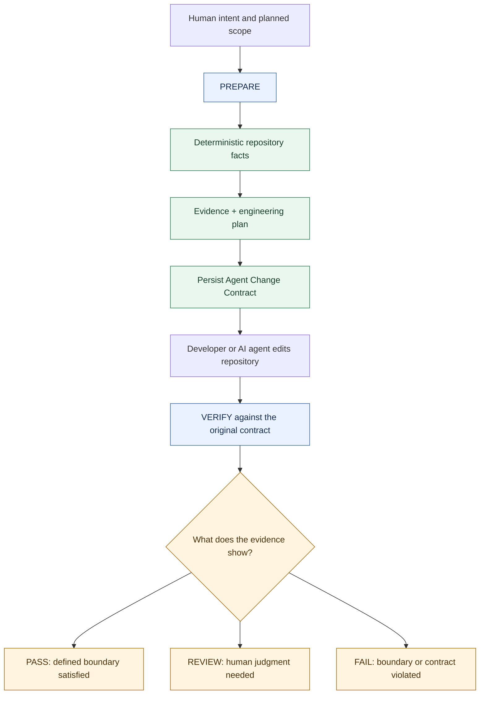

# Why Vericore?

> **AI writes the code. Vericore verifies the change.**

AI coding agents make software development faster. They also introduce a new engineering question:

> **How do we know the agent changed what we intended it to change?**

Traditional review happens after the repository has already changed. Vericore adds a repository-bound verification boundary before the edit.

## The problem

An agent can:

- touch files outside the intended scope;
- make a change broader than the original request;
- work from repository context that is no longer current;
- produce a plausible implementation that still needs engineering review.

The goal is not to prevent agents from changing code.

The goal is to make the **change boundary explicit and verifiable**.

## The Vericore model

The critical detail is that verification uses the **original persisted contract**. It does not silently create a new contract from the already-mutated repository.

## What makes the approach different?

### Evidence before AI

Vericore first builds deterministic repository evidence.

AI can interpret that evidence when enabled, but model output is not treated as the authoritative repository fact layer.

### Repository-bound state

Preparation records the repository identity and Git state used to establish the verification boundary.

### Fail-closed verification

If the persisted contract is missing, stale, tampered with, bound to another repository, or no longer matches the prepared change boundary, verification can fail rather than silently accepting a new interpretation.

### Local-first

Deterministic analysis does not require a Vericore cloud account or external AI provider.

### Agent-compatible

Vericore exposes the same verification boundary through the CLI and local MCP integration.

## What Vericore is not

Vericore is not:

- an AI coding agent;
- an autonomous source-code modifier;
- a replacement for tests;
- a replacement for human code review;
- a hosted source-code telemetry platform.

It is a **verification and engineering-intelligence layer around AI-assisted code changes**.

## Learn more

- [Getting Started](GETTING_STARTED.md)
- [Change Safety](CHANGE_SAFETY.md)
- [MCP / AI-Agent Integration](MCP.md)
- [Architecture](ARCHITECTURE.md)
- [Implementation Status](IMPLEMENTATION_STATUS.md)
